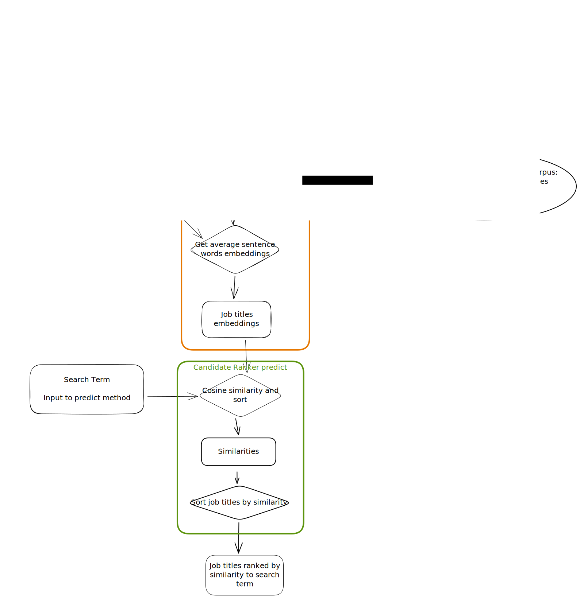

## Introduction

This project shows how to rank potential job candidates based on two criteria: 
- search term
- similarity to a candidate that is manually highlighted as an ideal candidate, based on
  - job title
  - location
  - number of connections

Used word embedding algorithms (Word2Vec and FastText) for computing the job title similarity and a geographic API for handling closeness of location.

### Visualize the notebook

The notebook should render correctly on GitHub: [Notebook](DataExploration.ipynb)

## Data description

The data comes in a CSV file: [potential-talents - Aspiring human resources - seeking human resources.csv](potential-talents%20-%20Aspiring%20human%20resources%20-%20seeking%20human%20resources.csv).

There are a total of 104 rows, one for each job candidate.

There are 3 fields:
- job_title. Job title.
- location. Location of the job candidate. The format is not unified: sometimes only the country is provided, sometimes the city, sometimes there are articles and other times there aren't, there are some mistakes... It needs some cleaning.
- connection. Number of connections on LinkedIn. If there are more than 500, a "+500" is written.

## Approach

First, a deep cleaning of the data was required:
- Fix mispellings in job title and location.
- Substitute "+500" by 500 in connections.

As stated, two criteria have been chosen to rank the candidates depending on the use case.

### Search term similarity
The first use case consists of ranking the candidates by using a search term. In this case we will find the similarity of the search term to each one of the candidate job titles.

The similarity will be computed by using the cosine similarity of the mean word embedding of the search term and the job titles.
First, each job title has been tokenized and normalized (lemmatized).
Then, the word embedding (converting each word into a vector that captures its meaning) has been achieved by using two different models in two different approaches:
- [Word2Vec](https://radimrehurek.com/gensim/models/word2vec.html) model that has been trained on the available data.
- [FastText](https://fasttext.cc/docs/en/english-vectors.html) model that was pretrained by Facebook on millions of Wikipedia articles.

### Starred candidate similarity
This use case consist on marking one candidate as the ideal candidate, and then sorting the rest of them based on the similarity to the first one:
- Job title. As in the previous case, the cosine similarity of word embeddings was used.
- Location. Given the variety of location formats, a geographic API that was accessed through the [geopy](https://geopy.readthedocs.io/en/stable/) package was used to find the location and give different similarity weights depending on whether the candidates are in the same city, state or country.
- Number of connections. In this case we didn't use the similarity because we considered that more connections is always better. In order to not make up any value system for number of connections, I just took the quantile as the connection score.

Finally, all three scores were multiplied by some configurable weight and summed.

## Conclussion
Two systems of ranking job candidates for two different use cases were built successfully.

Both approaches are fast and have simple but powerful parameters to modify their behavior.
